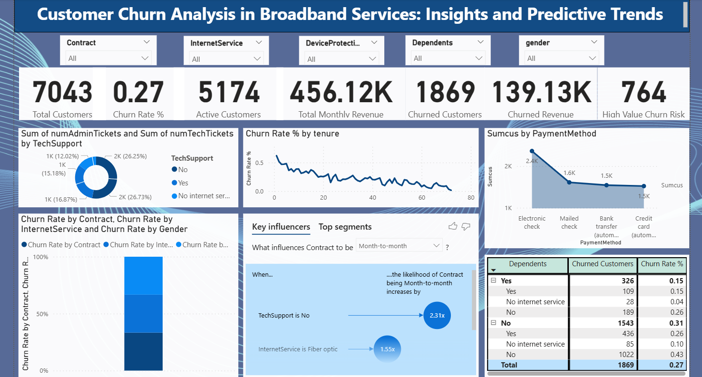

# Customer Churn Analysis in Broadband Services

# 📊 Customer Churn Analysis in Broadband Services: Insights and Predictive Trends  

### 📌 Project Overview  
This project analyzes **customer churn patterns in broadband services** to identify **key drivers of churn and predictive trends**.  
The dataset was sourced from **Kaggle (out of my personal interest)** and visualized using **Power BI**.  

The dashboard provides a 360° view of customer demographics, contracts, support interactions, revenue, and payment behavior.  

---

## ✅ Key Insights  

### 1. Overall Churn Metrics  
- **Total Customers**: 7,043  
- **Active Customers**: 5,174  
- **Churned Customers**: 1,869 (**27% churn rate**)  
- **Churned Revenue**: 139.13K  
- **High-Value Churn Risk**: 764 customers  

⚠️ **Problem**: Churn rate (27%) is high, creating significant revenue leakage.  

---

### 2. Churn by Tenure  
- Customers in their **first year (<12 months)** have **higher churn rates**.  
- Longer-tenure customers (≥24 months) are more **loyal**.  

💡 **Solution**:  
- Strengthen **onboarding programs**.  
- Provide **discounts/loyalty benefits** in the first year.  

---

### 3. Support Tickets & Churn  
- Customers with **no TechSupport** are **2.31x more likely** to churn.  
- High Admin/Tech ticket counts correlate with **dissatisfaction**.  

💡 **Solution**:  
- Enhance **TechSupport quality & SLA compliance**.  
- Introduce **AI-driven chatbots** and proactive support calls.  

---

### 4. Payment Methods & Churn  
- **Electronic check users** churn the most (2.4K customers).  
- Automated payments (bank transfer, credit card) reduce churn.  

💡 **Solution**:  
- Incentivize **auto-pay adoption** (discounts, cashback).  
- Simplify **billing experience**.  

---

### 5. Dependents & Churn  
- Customers **with dependents**: lower churn (**15%**)  
- Customers **without dependents**: higher churn (**31%**)  

💡 **Solution**:  
- Offer **family/household bundles**.  
- Launch **family-focused plans** with entertainment & child-safety add-ons.  

---

### 6. Contract & Service Type  
- **Month-to-month contracts** strongly linked to churn.  
- **Fiber optic service users** show higher churn vs DSL.  

💡 **Solution**:  
- Promote **annual contracts with discounts**.  
- Improve **fiber pricing & reliability**.  

---

## 🚩 Problems Identified  
1. High churn rate (27%) → revenue loss.  
2. Weak **first-year engagement**.  
3. Poor **TechSupport experience**.  
4. High churn with **manual payment methods**.  
5. Churn-prone **month-to-month contracts**.  
6. **Fiber customers** more dissatisfied.  

---

## 💡 Recommendations  
1. **Retention Programs**: Predict churn risk & offer targeted discounts.  
2. **Service Quality**: AI-driven support, proactive engagement.  
3. **Customer Loyalty**: Annual contracts, reward programs, OTT bundles.  
4. **Payment Optimization**: Push auto-pay adoption.  

---

## 📌 Final Note  
This churn analysis project was created using **Kaggle dataset (self-sourced out of personal interest)** and built into an interactive **Power BI dashboard**.  

It highlights **why customers leave**, what drives loyalty, and provides **data-driven strategies to reduce churn** and improve customer experience.  

---

### 🛠 Tools Used  
- **Power BI** → Dashboard & Visualization  
- **Excel / CSV** → Data Cleaning  
- **Kaggle Dataset** → Data Source  

---

⭐ If you found this project insightful, don’t forget to star ⭐ this repo!  
